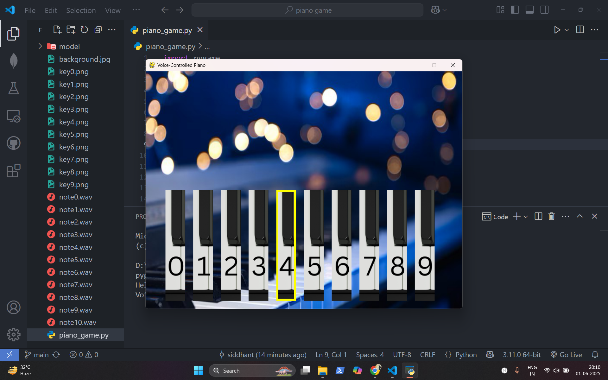
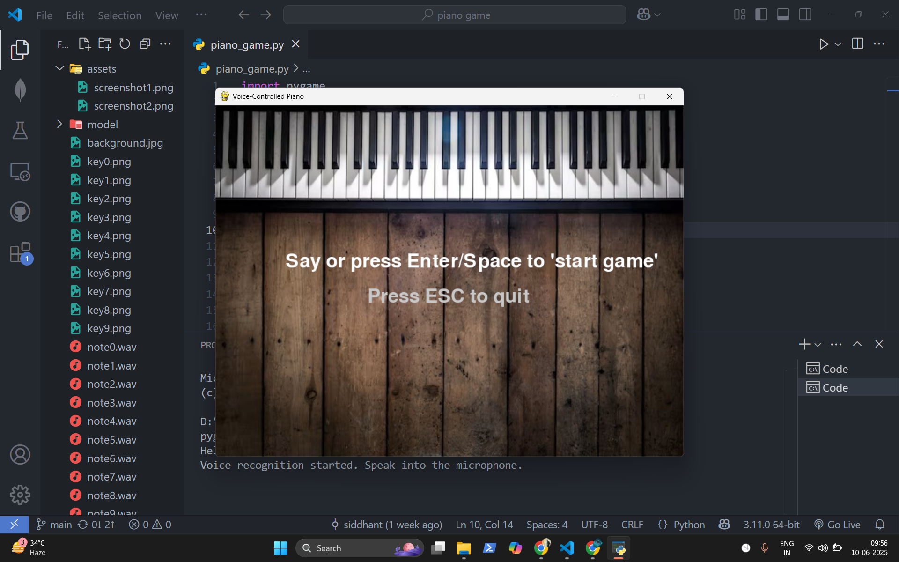

# 🎹 Voice-Controlled Piano Game

This is a Python-based voice-controlled piano game using **Pygame** and **Vosk** speech recognition.

## 🧠 Description

Control a piano with your **voice** by saying digits (0–9) or commands like `"start game"` and `"end game"`. You can also interact using your **keyboard** or **mouse**.

## Download Link

You can download the file from the following link:

[Download Here](https://drive.google.com/file/d/17945JuuY5-HqxBdZeItZModW5PvEoPQD/view?usp=drive_link)
  
## 🚀 Features

- 🎤 Voice control using Vosk + microphone
- 🎹 Piano keys (0–9) playable via:
  - Voice (e.g., "one", "two", ...)
  - Keyboard (0–9)
  - Mouse click
- 🔊 Realistic piano sounds
- 🖼️ Visual feedback (highlighted keys)
- ✅ Start and End game with voice or keyboard

## 🛠️ Requirements

- Python 3.7 or higher
- Install dependencies:
```
  pip install pygame sounddevice vosk
```
## 📁 Folder Structure
- Place all files in the same directory:
- voice_controlled_piano/
- ├── background.jpg
- ├── key0.png ... key9.png
- ├── note0.wav ... note9.wav
- ├── model/ (Vosk speech model folder)
- └── voice_controlled_piano.py

## ▶️ How to Run
```
    python voice_controlled_piano.py
```
- Then speak clearly:
"start game"
"zero", "one", ..., "nine"
"end game"
"close"

## Screenshots




---

## 🎹 **Voice-Controlled Piano Game (Project Explanation)**

### 🔧 **1. Module Imports and Initialization**

```python
import pygame, sys, queue, sounddevice as sd, vosk, json, threading, time
```

These modules do the following:

* `pygame`: Used for GUI and sound playback.
* `sys`, `time`, `threading`: System-level and timing operations.
* `queue`: Stores audio stream data safely across threads.
* `sounddevice`: Captures real-time microphone input.
* `vosk`: Performs **offline voice recognition**.
* `json`: Parses voice recognition results.

```python
pygame.init()
```

Initializes all `pygame` modules.

---

### 🖼️ **2. Screen Setup and Assets Loading**

```python
screen = pygame.display.set_mode((800, 600))
pygame.display.set_caption("Voice-Controlled Piano")
font = pygame.font.SysFont(None, 48)
```

* Creates a window of 800x600 pixels.
* Sets the window title.
* Loads a default system font for displaying text.

#### 📷 Background and Piano Keys

```python
background = pygame.image.load("background.jpg")
background = pygame.transform.smoothscale(background, (800, 600))
```

```python
for i in range(10):
    image = pygame.image.load(f"key{i}.png")
    key_images.append(image)
    key_rects.append(pygame.Rect(50 + i * 70, 300, image.get_width(), image.get_height()))
```

* Loads a background image and scales it.
* Loads **10 piano key images** (`key0.png` to `key9.png`).
* Places each key at fixed positions with `pygame.Rect()`.

#### 🔊 Sounds

```python
for i in range(10):
    sound = pygame.mixer.Sound(f"note{i}.wav")
    sounds.append(sound)
```

Loads 10 sound files (`note0.wav` to `note9.wav`) corresponding to piano notes.

---

### 🧠 **3. Voice Recognition Setup**

```python
model = vosk.Model("model")
```

Loads the Vosk speech recognition model from the `"model"` folder.

```python
def callback(indata, ...):
    q.put(bytes(indata))
```

This callback collects live microphone input and stores it in a queue for processing.

```python
def recognize_speech():
    ...
    rec = vosk.KaldiRecognizer(model, 16000)
```

This function continuously:

* Reads microphone input from the queue.
* Uses `vosk` to recognize speech.
* If words like “start game”, “one”, “five”, or “end game” are detected, it calls `process_command()`.

This function runs in a separate **background thread**, so the main game loop is not blocked.

---

### 🎮 **4. Command Processing and Key Playing**

```python
def process_command(command):
    ...
```

Handles voice commands:

* **"start game"**: starts the game.
* **"end game"**: ends the game.
* **"close"**: exits the app.
* If the game is running, it plays any number mentioned (e.g. saying "three" or "seven").

```python
def play_key(index):
    sounds[index].play()
    highlighted_key = index
```

Plays the sound and visually highlights the key.

---

### 🧠 **5. Word to Digit Mapping**

```python
word_to_digit = { "zero": 0, ..., "nine": 9 }
```

Used to convert spoken words like “five” into the number 5.

---

### 🌀 **6. Game Loop**

```python
while running:
```

The main loop runs continuously:

#### 📌 Event Handling:

```python
for event in pygame.event.get():
```

Handles:

* `QUIT`: closing the window
* `KEYDOWN`: keyboard inputs:

  * `ENTER/SPACE`: start game
  * `ESC`: end or quit game
  * `0-9`: play respective keys
* `MOUSEBUTTONDOWN`: click on-screen piano keys to play

#### 🧠 Game State Logic

* **game\_started = True**: show keys and allow input.
* **game\_ended = True**: show end screen.
* **Neither**: show start screen.

#### ⌛ Highlighting Logic:

```python
if i == highlighted_key and (current_time - highlight_time < 0.3):
```

Temporarily draws a yellow border around the last played key.

---

### ✅ **7. Exiting and Cleanup**

```python
pygame.quit()
```

Closes the window and cleans up resources.

---

## 🧪 **What to Say in Viva: Key Points**

1. **What is the project?**

   > "It's a piano simulation game controlled using voice commands. The player can start or end the game and play keys using their voice or keyboard."

2. **Which technologies did you use?**

   > `"pygame"` for GUI and sound, `"vosk"` for offline voice recognition, and `"sounddevice"` for real-time microphone input."

3. **How does voice recognition work?**

   > "A background thread listens to the microphone. It uses Vosk to convert speech to text and maps spoken words like 'five' to corresponding piano keys."

4. **How many control modes?**

   > "There are three: keyboard, mouse (clicking keys), and voice (e.g., saying 'two')."

5. **How does the user interact?**

   > "User starts the game by saying 'start game' or pressing Enter. Then, they say any number from 0 to 9 to play a piano note."

6. **How did you handle real-time audio?**

   > "Using a queue and a separate thread for microphone input so that the main GUI doesn't lag."

7. **Why Vosk?**

   > "Because it works offline and doesn't need an internet connection."

---


