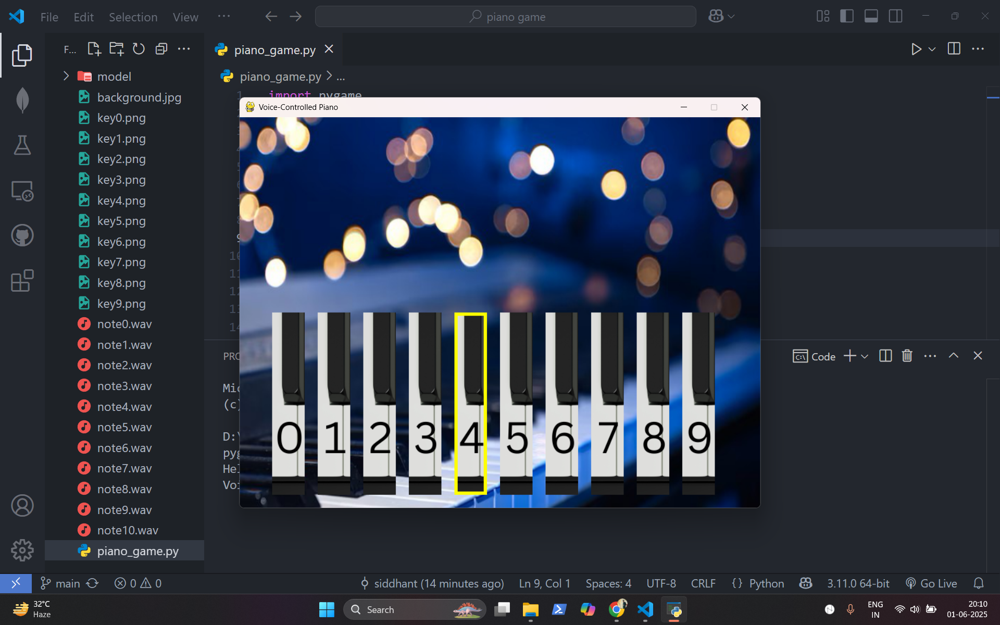
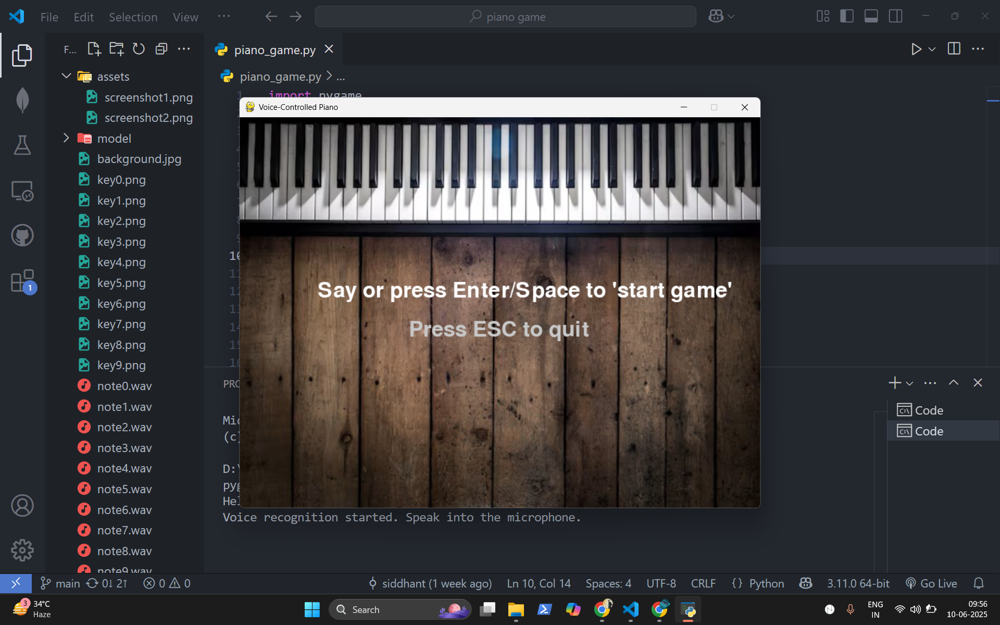

# 🎹 Voice-Controlled Piano Game

This is a Python-based voice-controlled piano game using **Pygame** and **Vosk** speech recognition.

## 🧠 Description

Control a piano with your **voice** by saying digits (0–9) or commands like `"start game"` and `"end game"`. You can also interact using your **keyboard** or **mouse**.

## Download Link

You can download the file from the following link:

[Download Here](https://drive.google.com/file/d/17945JuuY5-HqxBdZeItZModW5PvEoPQD/view?usp=drive_link)
  
## 🚀 Features

- 🎤 Voice control using Vosk + microphone
- 🎹 Piano keys (0–9) playable via:
  - Voice (e.g., "one", "two", ...)
  - Keyboard (0–9)
  - Mouse click
- 🔊 Realistic piano sounds
- 🖼️ Visual feedback (highlighted keys)
- ✅ Start and End game with voice or keyboard

## 🛠️ Requirements

- Python 3.7 or higher
- Install dependencies:
```
  pip install pygame sounddevice vosk
```
## 📁 Folder Structure
- Place all files in the same directory:
- voice_controlled_piano/
- ├── background.jpg
- ├── key0.png ... key9.png
- ├── note0.wav ... note9.wav
- ├── model/ (Vosk speech model folder)
- └── voice_controlled_piano.py

## ▶️ How to Run
```
    python voice_controlled_piano.py
```
- Then speak clearly:
"start game"
"zero", "one", ..., "nine"
"end game"
"close"

## Screenshots




## 🧑‍💻 Author
- Siddhant Saxena
- B.Tech CSE, JIIT Noida
